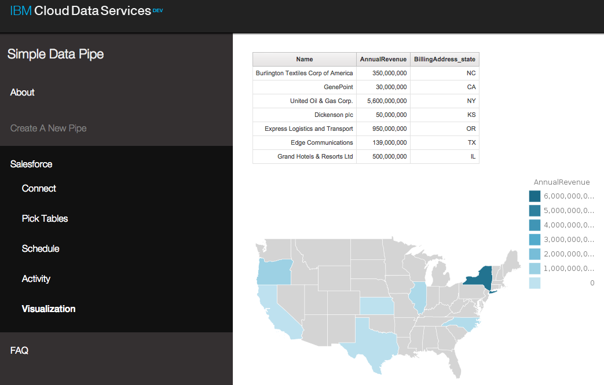

# CRM Business Intelligence

### Customer Relationship Management (CRM) application using the Simple Data Pipes app

The CRM Business Intelligence application demonstrates how you can use the **Cloudant NoSQL DB**, **DataWorks**, **dashDB**, and
**Embeddable Reporting** together with Salesforce to analyze, transform, and visualize your data.

## Introduction
This CRM Business Intelligence sample application has been created so you can deploy it into your personal DevOps space after signing up for Bluemix and
DevOps Services. You will attach the **Cloudant NoSQL DB**, **DataWorks**, **dashDB**, and **Embeddable Reporting** services. Once the
application is set up, you will be able to interact with Salesforce data using the Simple Data Pipes app,
view the data with **dashDB**, and create reports in **Embeddable Reporting** with IBM's Cognos Business Intelligence.

## Sign up for and log into Bluemix and DevOps

Sign up for Bluemix at https://console.ng.bluemix.net and DevOps Services at https://hub.jazz.net. When you sign up, you'll create an
IBM ID, create an alias, and register with Bluemix.

## Fork Project to a personal DevOps space

First, fork the publicly accessible repository hosted in http://hub.jazz.net to your personal DevOps space. This will allow you to deploy the CRM app to Bluemix, create instances of the app, and attach services to the app.

1. Navigate to [the tutorial's repository](https://hub.jazz.net/project/cfsworkload/pipes-app/overview).
2. In top right of the page, click **Fork Project**. A pop-up menu will appear where you'll provide information about the forked project.
3. In **Name your project**, enter a name for your project.
4. Select an **Organization** and **Space** for your project, then click **CREATE**.

## Edit launch configurations

Next, you'll edit the launch configurations in order to deploy your website.

1. After the project is successfully forked, click **EDIT CODE** in the upper right corner of the screen.
2. In the top navigation bar, click the drop-down menu and click the pencil icon to the right of the app name to edit the launch configuration. A dialog box will appear and you will be required to enter information about where the code will be deployed to.

  

3. Check that your **Target**, **Organization**, and **Space** are correct.
4. Enter a unique name in the **Application Name** field. This creates the domain route that you will use to navigate to your website once the app is deployed.
5. Enter the same application name into the **Host** field.
6. Verify that the **Domain** field is correct, and click **Save**.
7. Click the play icon to the right of the drop-down menu to deploy your application.

  

8. Once the app deploys, navigate to the Bluemix Dashboard. Your new app will appear in the Applications section.

  

9. Clicking the app. At the top of the page underneath your app name, there should be a field labelled **Routes**.
Click the route link to launch your web application.
10. Take a moment to check out your simple data pipes website! Then, create a new pipe from the left sidebar.
11. In the **Type** field, select **Salesforce**. Give it a **Name**, and also a **Description** if you wish, then click **Proceed**.

12. Copy down the Callback URL in the following back. You'll need it later to connect Salesforce.

We've got all that we need from the Simple Data Pipes web application at the moment, so let's head back to Bluemix.

## Connect Embeddable Reporting to Cloudant NoSQL DB and dashDB

Now you'll connect the Embeddable Reporting service to Cloudant
NoSQL DB and dashDB.

1. In the Bluemix Dashboard, select your app and select **Environment Variables** from the left sidebar.

  

  These variables contain the information needed to connect to each service. Some of these variables will be important later.
2. Copy the following fields into a text file for easy access:
  * Cloudant `url`

  

  * dashDB `username`
  * dashDB `password`
  * dashDB `jdbcurl`

  

3. Now, you'll click **Embeddable Reporting** in the left sidebar to set up the service.
4. Once the page loads, enter the Cloudant URL into the **Repository URL** field.

  

5. Download the **pipes-report.zip** file from the pipes-app workspace.
6. In the Embeddable Reporting service console, click **Import Package** and import the previously downloaded pipes-report.zip.
  
7. You'll now configure the data source to point to your dashDB database instead. In the **Data Sources** tab, click the data source **Name**
or hover over the **Actions** row and click the **View Properties** icon.
  
8. Select **Edit**, and then change the **JDBC URI**, **User Name**, and **User Password** to the values that you previously copied.
9. Click **Update**.
10. In the **Report Definitions** tab, copy the **ID** for USA-Map. You'll use this later to display data on a USA chart in your Simple Data Pipes website.

  

11. From the Report Definitions view, you can launch a Report by clicking the **Author** pencil icon within the **Actions** column.
This will take you into IBM's Cognos Business Intelligence, where you can create and edit queries, make visualizations, and more!

  While you'll be using map of the USA, we've included another Report with a sample query that you can view and make changes to if you wish.

## Create a Connected App in Salesforce

For this part, you'll need to create a Salesforce account if you don't have one already.
You can sign up one at https://developer.salesforce.com/signup.

1. After logging in to Salesforce, click **Setup** in the top right of the page or in the drop-down menu by your username.
  
2. In the left sidebar under the **Build** section, click the arrow next to **Create**.
  
3. Select **Apps**, and in the next page, scroll down to **Connected Apps** and click **New**.
  
4. Choose a unique **Connected App Name**. This will automatically be assigned to your **API Name** in the field below as well.
5. **Enable OAuth Settings**, and set the Callback URL as the URL given in your pipes app that you copied earlier.
6. Add all **Available OAuth Scopes** to **Selected OAuth Scopes**.
  
7. Scroll down to the bottom of the page and **Save**, then click **Continue** on the following screen.
8. In the next screen, copy your **Consumer Key** and **Consumer Secret**. You'll use these to finalize the connection in your pipes app. You will need to wait 2-10 minutes for Salesforce to successfully initialize your new Connected App.
  

## Load tables from Salesforce into your Simple Pipes app

We can now go back to your Pipes web app and load the tables into your database from Salesforce.

1. Navigate to the **Connect** tab in the pipe that you created earlier.
2. Enter the **Consumer key** and **Consumer secret**, then click **Connect to Salesforce**. You will need to wait for the Connected App to be initialized, which takes between 2-10 minutes. Once the pipe is connected to the app, you can load the sample Salesforce data into the app.
  
3. Hit **Save and Continue** to set up the pipe.
4. Select **All Tables** and click **Save and Continue**. This will give you access to all of the sample data.
4. Now you can schedule a regular update from Salesforce to the app or  click **Skip** to sync the data now. Since that's faster, hit **Skip**.
5. Click the **Run now** button to start loading your data into your pipes app.
  

  Now that the data is in the app, you can view it in dashDB! If you want to look at it, navigate to the service in the Bluemix Dashboard and click **LAUNCH** in the top right.
  

  You can look at individual tables through the sidebar on the left.
  

## Load the report visualization into the web page

Now that the data is connected to the report engine, you can visualize the data.

1. In DevOps Services, click **Edit Code** and navigate to the /app/js/initReporting.js file.
2. At the bottom of the file, in the `insertReports()` function, paste the USA-Map report ID from the **Embeddable Reporting** service as the `id` variable.
  
3. Redeploy the app using the **Deploy** button.
4. After the app re-deploys, go back and refresh your web app.
5. Select the pipe and click **Visualization** in the left navigation menu. You'll see a visualization of the Salesforce
sample data! You can edit the report or make your own using the Enbeddable Reporting service.
  

# What does the app do?

The CRM Business Intelligence app allows you to load data with the Simple Pipes app, view that data with dashDB, and
leverage IBM's Cognos to perform comprehensive analysis and visualization.

We've shown you how to connect the pipes from Salesforce all the way through to visualization with a dynamic map generated from your Salesforce data. Now, it's up to you to utilize those pieces to the fullest.

If you want to learn more about Embeddable Reporting, you can go here for another example:
https://www.ng.bluemix.net/docs/services/EmbeddableReporting/index.html.

IBM offers several types of charts and data visualization tools that aren't in the default Cognos package. To learn more, go to
http://www.ibm.com/web/portal/analytics/analyticszone/home.
