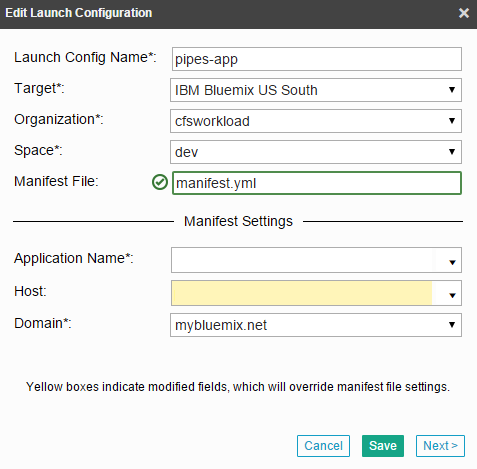

# CRM Business Intelligence 

### Customer Relationship Management application using the Simple Data Pipes app

The CRM Business Intelligence application demonstrates how you can use the **Cloudant NoSQL DB**, **DataWorks**, **dashDB**, and 
**Embeddable Reporting** together with Salesforce to analyze, transform, and visualize your data.

## Introduction
The Hybrid Data Storage application has been created so you can deploy it into your personal space after signing up for Bluemix and 
DevOps Services. You will attach the **Cloudant NoSQL DB**, **DataWorks**, **dashDB**, and **Embeddable Reporting** services. Once the 
application is set up, you will be able to interact with Salesforce data, viewing it with **dashDB** and creating reports in IBM's Cognos 
Business Intelligence.

## Sign up for and log into Bluemix and DevOps

Sign up for Bluemix at https://console.ng.bluemix.net and DevOps Services at https://hub.jazz.net. When you sign up, you'll create an
IBM ID, create an alias, and register with Bluemix.

## Fork Project to a Personal DevOps Space

The first step is to fork the publicly accessible repository hosted in http://hub.jazz.net to your personal DevOps space. Once you do 
this, you will be able to deploy the code to Bluemix and spin up instances of the CRM app and create attached instances of all the 
required services.

1. Navigate to [the tutorial's repository](https://hub.jazz.net/project/cfsworkload/pipes-app/overview).
2. In top right of the page, click **Fork Project**. A pop-up menu will appear where you'll provide information about the forked project.
3. In **Name your project**, enter a name for your project.
4. Select an **Organization** and **Space** for your project. Then click **CREATE**.

## Edit Launch Configurations

Next, you'll need to edit the launch configurations in order to deploy your website. 

1. After the project is successfully forked, click the "EDIT CODE" button in the upper right corner. 
2. In the top navigation bar, click the drop down menu and select the pencil edit to edit your launch config.

3. Check to make sure that your Target, Organization, and Space are correct. Then, enter a unique name in the **Application Name** field. This will be your domain route that you will use to navigate to your website once it's deployed. Enter the same name into the **Host** field.
4. Verify that the **Domain** field is correct, and click Save. Click the "Play" arrow right next to the drop down menu to deploy your application!

5. Once the app is successfully deployed and running normally, go to Bluemix to check and see that your app has been created. 

6. Head into the app dashboard by clicking the app. At the top of the page underneath your app name, there should be a field labelled "Routes".
Click the route link to launch your web application.
7. Take a moment to check out your simple data pipes website! Then, create a new pipe from the left sidebar. 
8. In "Type", choose SalesForce. Give it a name, and also a description if you wish. Proceed.

9. Copy down the Callback URL in the following back. You'll need it later to connect SalesForce. 

We've got all that we need from the Simple Data Pipes web application at the moment, so let's head back to Bluemix.

## Connect Embeddable Reporting to Cloudant NoSQL DB and dashDB

Now you'll need to connect the Embeddable Reporting service to Cloudant 
NoSQL DB and dashDB. Select your app from the Bluemix dashboard and select **Enviroment Variables** from the left sidebar.

These variables contain the information needed to connect to each service. Some of these variables will be important later. Copy the following fields into a 
file for easy access:

- **Cloudant** url

- **dashDB** username
- **dashDB** password
- **dashDB** jdbcurl

Now navigate to the **Embeddable Reporting** service using the left sidebar. Once it loads, enter the **Cloudant** url into the **Repository** 
text field.

1. Download the **pipes-report.zip** file from the pipes-app workspace.
2. In the Embeddable Reporting service console, click "Import Package" and upload the previously downloaded pipes-report.zip.

3. You now need to configure the data source to point to your dashDB database instead. In the "Data Sources" tab, click the data source Name
or mouse over the Actions row and click the "View Properties" icon.

4. Select Edit, and then change the JDBC URI, User Name, and User Password to the values that you copied down previously. Update.
5. Now go to the "Report Definitions" tab and copy down the ID for USA-Map. 
You'll need this later to connect your Simple Data Pipes website to display the visualization.

## Create a Connected App in Salesforce

For this part, you'll need to create a Salesforce account if you don't have one already. 
You can sign up for that here: https://developer.salesforce.com/signup

1. After logging in to Salesforce, click Setup in the top right of the page or in the drop down menu by your username.

2. In the left sidebar, go to the section labelled "Build" and click the arrow next to "Create".

3. Select Apps, and in the subsequent page, scroll down to "Connected Apps" and click "New".

4. Choose a Connected App Name (must be unique). This will automatically be assigned to your API Name in the field below as well.
5. Enable OAuth Settings, and set the Callback URL as the URL given in your pipes app that you collected earlier.
6. Add all Available OAuth Scopes to Selected OAuth Scopes. 

7. Scroll down to the bottom of the page and save. Then click Continue on the following screen. In the next page, grab your Consumer Key
and Consumer Secret. You'll use these to finalize the connection in your pipes app. You will need to wait 2-10 for SalesForce to 
successfully initialize your new Connected App.

## Load Tables from SalesForce into your Simple Pipes App

We can now go back to your Pipes web app and load the tables into your database from SalesForce. 

1. Navigate to the "Connect" tab in the pipe that you created earlier. Enter the Consumer Key and Consumer Secret and click Connect to SalesForce. 
You will need to wait for the Connected App to be initialized first which takes between 2-10 minutes.

2. Once the pipe is connected to the app, you can load the sample Salesforce data into the app. Hit **Save and Continue** to set up the pipe.
3. Select **All Tables** and hit **Save and Continue**. This will give access to all of the sample data.
4. Now you can schedule a regular update from Salesforce to the app or just click **Skip** to sync the data now. Since that's faster, hit **Skip**.
5. Click the "Run Now" button in the next page to start loading your data into your pipes app.

6. There is a visualization tab shown in the sidebar, but that isn't connected yet. We'll get to that soon.

Now that the data is in the app, you can view it in dashDB! If you want to look at it, navigate to the service through BlueMix and click the 
**Launch** button in the top right.

You can look at individual tables through the sidebar on the left.

## Load the Report Visualization into the Web Page

Now that the data is connected to the report engine, we can visualize the data.

1. In HubJazz, go into the **Edit Code** mode and navigate to /app/js/initReporting.js
2. At the bottom of the file, in the **insertReports()** function, paste the USA-Map report ID from the **Embeddable Reporting** service as the "**id**" 
variable.

3. Redeploy the site using the deploy button.

After it's finished re-deploying, go back and refresh your web app, select the pipe, and select the visualization tab, you should see a visualization of some of the Salesforce 
sample data! You can edit the report or make your own using the **Enbeddable Reporting** service.

IBM offers several types of charts and data visualization tools that aren't in the default Cognos package. To learn more, go to 
http://www.ibm.com/web/portal/analytics/analyticszone/home

