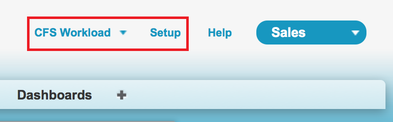
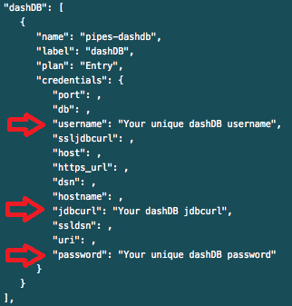
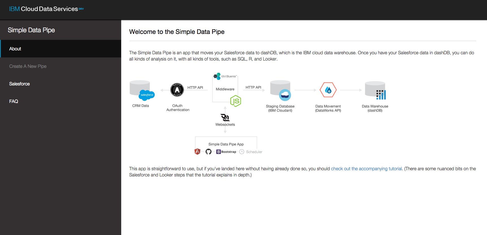
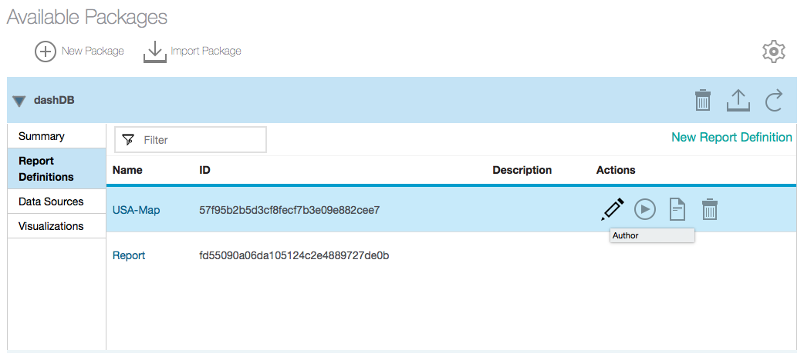
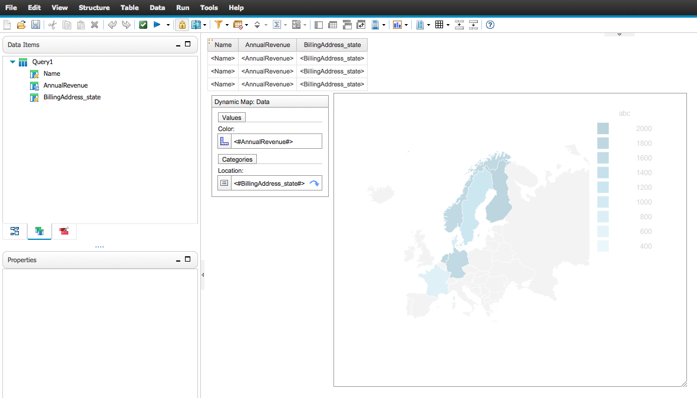

# CRM Business Intelligence

### Customer Relationship Management (CRM) application using the Simple Data Pipes app

The CRM Business Intelligence application demonstrates how you can use the **Cloudant NoSQL DB**, **DataWorks**, **dashDB**, and
**Embeddable Reporting** together with Salesforce to analyze, transform, and visualize your data.

## Introduction
This CRM Business Intelligence sample application has been created so you can deploy it into your personal DevOps space after signing up for Bluemix and
DevOps Services. You will attach the **Cloudant NoSQL DB**, **DataWorks**, **dashDB**, and **Embeddable Reporting** services. Once the
application is set up, you will be able to interact with Salesforce data using the Simple Data Pipes app,
view the data with **dashDB**, and create reports in **Embeddable Reporting** with IBM's Cognos Business Intelligence.

If you already know how Bluemix works and don't want to go through the process of manually forking the project and editing the launch
configuration, click the **Deploy to Bluemix** button below to deploy your app. After the deployment is finished, jump to the **Edit launch configuations**
section and begin with step 8.

## Sign up for and log into Bluemix and DevOps

Sign up for Bluemix at https://console.ng.bluemix.net and DevOps Services at https://hub.jazz.net. When you sign up, you'll create an
IBM ID, create an alias, and register with Bluemix.

## Fork Project to a personal DevOps space

Our source code is stored on GitHub. To fork the project into your own repository navigate to https://github.com/cfsworkload/business-intelligence.

1. Navigate to https://hub.jazz.net/
2. Click **CREATE PROJECT**
3. Select **Link to an existing GitHub repository**
4. Select **Link to a Git Repo on GitHub**
5. Choose your newly forked project from the dropdown menu that appears.
6. Choose your **Region**, **Organization**, and **Space**.  Generally the defaults will be sufficient.
7. Click **CREATE**. This will fork your GitHub project into IBM DevOps services, and redirect you to your new project.

## Edit launch configurations

Next, you'll edit the launch configurations in order to deploy your app.

1. After the project is successfully forked, click **EDIT CODE** in the upper-right corner of the screen.
2. In the top navigation bar, click the drop-down menu and click the pencil icon to the right of the app name to edit the launch configuration. A dialog box will appear and you will be required to enter information about where the code will be deployed to.

  

3. Check that your **Target**, **Organization**, and **Space** are correct.
4. Enter a unique name in the **Application Name** field. This creates the route that you will use to navigate to your web app after deployment.
5. Enter the same application name into the **Host** field.
6. Verify that the **Domain** field is correct and click **Save**.
7. Click the play icon to the right of the drop-down menu to deploy your application. This will deploy the application to Bluemix with all of the necessary services.

  

8. While you wait for the app to deploy, download pipes-reports.zip from the workspace. You'll need this to create your reports.
9. Once the app deploys, navigate to the Bluemix Dashboard. Your new app will appear in the Applications section.

  

10. Click the tile for the app to enter the app Overview page.
11. At the top of the page, underneath your app name, take a note of the route that your app has. It should be the name you gave the application earlier,
followed by the domain path. You'll need the route to connect to Salesforce in the next section.

Now that you've deployed the app and have the route set up, you can head on over to Salesforce.

## Create a connected app in Salesforce

For this part, you'll need to create a Salesforce account if you don't have one already.
You can sign up one at https://developer.salesforce.com/signup.

1. After logging in to Salesforce, click **Setup** in the top right of the page or in the drop-down menu by your username.
  
2. In the left sidebar under the **Build** section, click the arrow icon to the left of **Create**.
  
3. Click **Apps**, and in the next page, scroll down to **Connected Apps** and click **New**.
  
4. Choose a unique **Connected App Name**. This will automatically be assigned to your **API Name** in the next field  as well.
5. **Enable OAuth Settings** and set the Callback URL as the website route that you saw previously, and append "/authCallback" to the end of it.
For example, if you named your app "random-pipes-route" and the domain is "mybluemix.net,"
then your Callback URL would be "https://random-pipes-route.mybluemix.net/authCallback."
6. Add all **Available OAuth Scopes** to **Selected OAuth Scopes**.
  
7. Scroll down to the bottom of the page and **Save**, then click **Continue** on the following screen.
8. Copy your **Consumer Key** and **Consumer Secret**. You'll use these to finalize the connection in your Pipes app. You will need to wait 2-10 minutes for Salesforce to successfully initialize your new connected app.
  

While you wait for Salesforce to create and initialize your new Connected App, let's go ahead and connect the services.

## Connect Embeddable Reporting to Cloudant NoSQL DB and dashDB

Now you'll connect the Embeddable Reporting service to Cloudant
NoSQL DB and dashDB.

1. In the Bluemix Dashboard, click the tile for your app and select **Environment Variables** from the left sidebar.

  

  This file has the information you'll need to connect to each service. Some of these variables will be important later.
2. Copy the following fields into a text file for easy access:
  * Cloudant `url`

  

  * dashDB `username`
  * dashDB `password`
  * dashDB `jdbcurl`

  

3. Now, you'll click **Embeddable Reporting** in the left sidebar to set up the service.
4. Enter the Cloudant URL in the **Repository URI** field.

  

5. In the Embeddable Reporting service dashboard, click **Import Package** and import the pipes-report.zip file.

  

6. You'll now configure the data source to point to your dashDB database. In the **Data Sources** tab, click the data source **Name**
or hover over the **Actions** row and click the **View Properties** icon.

  

7. Select **Edit**, and then change the **JDBC URI**, **User Name**, and **User Password** to the values copied from your environmental variables.
8. Click **Update**.
9. In the **Report Definitions** tab, copy the **ID** for USA-Map. You'll use this later to display data on a dynamic map of the USA.
While you'll be using a map of the USA, we've included another report with a sample query that you can view and make changes to if you wish.

 

10. From the Report Definitions view, you can launch a report by clicking the **Author** pencil icon within the **Actions** column.This will take you into IBM's Cognos Business Intelligence, where you can create and edit queries, make visualizations, and more.

## Revise your code so it can display the report visualization
You'll now use the DevOps Services IDE to edit your code to display the USA map.

1. In DevOps Services, click **EDIT CODE** and navigate to the /app/js/initReporting.js file.
2. At the bottom of the file, in the `insertReports()` function, paste the USA-Map report ID from the Embeddable Reporting service as the `id` variable.
  

3. Redeploy the app using the **Deploy** button.

You're now finished deploying and setting up the behind-the-scenes part of the app.
In the following sections, we'll show you what you can do with the web app.

# What does the app do?

The CRM Business Intelligence app allows you to load data with the Simple Pipes app, view that data with dashDB, and
leverage IBM's Cognos to perform comprehensive analysis and visualization of your data.

## Load tables from Salesforce into your Simple Pipes app

You can now go back to your Pipes app and load the Salesforce data into your database.

1. Take a moment to check out your Simple Data Pipes website! Then, create a new pipe from the left sidebar.
  

2. In the **Type** field, select **Salesforce**. Give it a **Name**, and also a **Description** if you want, then click **Proceed**.
  

3. Navigate to the **Connect** tab in the pipe that you created earlier.
4. Enter the **Consumer key** and **Consumer secret**, then click **Connect to Salesforce**. You will need to wait for the Salesforce connected app you created earlier to finish being initialized. If it hasn't finished, an error will be displayed but you can try again. Once the pipe is connected to the app, you can load the sample Salesforce data into the app.
  

5. Hit **Save and Continue** to set up the pipe.
6. Select **All Tables** and click **Save and Continue**. This will give you access to all of the sample data.
7. Click **Skip** to sync the data now. In the future, you have the option to schedule regular updates from Salesforce.
8. Click **Run now** to start loading your data into your Pipes app.
  

9. After your pipe has successfully completed, you can view the report visualization.
Click **Report Visualization** in the left navigation bar to see some of the Salesforce
sample data.

  

## View your data using dashDB

Now that the data is in the app, you can also view it in dashDB. If you want to take a look at it, navigate to the tile for the service in the Bluemix Dashboard and click **LAUNCH** in the top right.

You can look at individual tables through the left navigation bar.

## Use Embeddable Reporting to access your report and query

The Embeddable Reporting console and IBM Cognos Report Studio allow you to make changes to your query and visualization.

1. To access your query, head over to the service console within your Bluemix app dashboard.

2. Open your dashDB connection, and click the **Report Definitions** tab.

3. Click the **pencil** icon on the report row underneath the **Actions** label. IBM Cognos Report Studio will launch in another tab.

4. You can see the table data and visualization in the main page, along with the query by going into the **View** tab.

5. You can edit the query after accessing it in the **View** tab, and make changes to the table data and visualization using the main workspace area and the left sidebar.
You can also add charts, graphs, visualizations, and more by clicking the **toolbox** icon in the sidebar.

If you want to learn more about Embeddable Reporting, you can go here for another example:
https://www.ng.bluemix.net/docs/services/EmbeddableReporting/index.html.

The visualization you've used in this walkthrough is a Dynamic Map visualization.
It, along with many others, is provided for free from IBM Analytics zone.
You can import them in the **Visualizations** tab in your dashDB connection.
To access these visualizations and more, go to http://www.ibm.com/web/portal/analytics/analyticszone/home.

We've shown you how to connect the pipes from Salesforce all the way through to visualization with a dynamic map generated from your Salesforce data. Now, it's up to you to utilize those pieces to the fullest.
